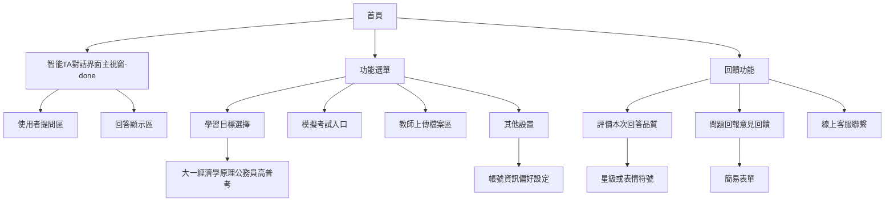

# Backend API

## Authentication

## POST /api/v1/authentication/login/

```python

Authenticate a user and generate a JWT token upon successful login.

This function handles the user login process. It verifies the provided credentials, generates a JWT token for authenticated users, and stores the token in the database.

Args: login_form (LoginFormModel): An object containing the user's login credentials. It includes the following attributes: - username (str): The user's username. - hashed_password (str): The hashed password of the user.

Returns: Union[LoginFormSuccessModel, LoginFormUnsuccessModel]: - If login is successful, returns a LoginFormSuccessModel containing: - status_code (int): HTTP status code (200 for success). - success (bool): True for successful login. - jwt_token (str): The generated JWT token. - role (str): The role of the authenticated user. - If login fails, returns a LoginFormUnsuccessModel containing: - status_code (int): HTTP status code indicating the error. - success (bool): False for failed login. - response (int): The error status code.

Raises: HTTPException: - 500 status code if there's an unknown issue during token insertion. - 401 status code if the credentials are unrecognized.

```

- #### Parameters

    - username: string

    - password: string

- #### Responses

    - status_code: integer

    - success: boolean

## POST /api/v1/authentication/signup/

```python

Register a new user with the provided username and password.

This function handles the user registration process. It hashes the provided password using SHA3-256 algorithm and attempts to create a new user in the database.

Args: username (str): The desired username for the new user account. password (str): The password for the new user account (will be hashed before storage).

Returns: SingUpSuccessModel: An object containing: - status_code (int): HTTP status code (200 for success). - success (bool): True if the user was successfully created.

Raises: HTTPException: - 500 status code if there's an internal server error during user creation.
```

- #### Parameters

    - username: string

    - password: string

- #### Responses

    - status_code: integer

    - success: boolean

---

## Chatroom API

## GET /api/v1/authentication/signup/

```python

Generates uuid for a new chatroom.

Returns: uuid: String

```

## POST /api/v1/chatroom/rating/

```python
Update the rating for a specific answer in the chatroom.

This function receives a rating for an answer, updates it in the database, and returns the status of the operation.

Args: rating_model (RatingModel): A model containing the rating information. It includes: - question_uuid (str): The unique identifier of the question. - rating (bool): The rating given to the answer (True for positive, False for negative).

Returns: AnswerRatingModel: A model containing the result of the rating operation. It includes: - status_code (int): HTTP status code (200 for success). - success (bool): Indicates whether the rating update was successful.

Raises: HTTPException: If there's an internal server error (status code 500).
```

- #### Request body
    - question_uuid: string
    - rating: Boolean
- #### Responses
    - status_code: integer
    - success: boolean

## POST /api/v1/chatroom/{chat_id}/

```python
Ask the question and return the answer from RAG

Args: Args: chat_id (str): chatroom uuid question (str): question content user_id (str): user id collection (str, optional): collection of docs database. Defaults to "default". language (str): language for the response

Returns: answer: response of the question server_status_code: 200 | 500
```

- #### Request body
    - chat_id: string
    - user_id: string
    - language: string = "CHINESE"
    - collection: string = "default"
    - question: \[string\]
- #### Responses
    - status_code: integer
    - question_uuid: string
    - answer: string
    - files: list\[string\]

---

# Documentation

## GET /api/v1/documentation/{docs_id}

```python
Retrieve and return a specific document file based on its unique identifier.

This function fetches the document file associated with the provided docs_id from the file system and returns it as a FileResponse. It also handles error cases such as empty requests or non-existent files.

Args: docs_id (str): The unique identifier of the document to retrieve.

Returns: FileResponse: A FileResponse object containing the requested document file.

Raises: HTTPException: - 422 status code if the docs_id is empty. - 500 status code if the UUID format is incorrect or the file is not found.
```

- #### Parameters
    - docs_id: string
- #### Responses
    - FileResponse

## GET /api/v1/documentation/{documentation_type}

```python
Retrieve a list of documents based on the specified documentation type.

This function queries the database for documents matching the given documentation type and returns a list of these documents.

Args: documentation_type (str, optional): The type of documentation to retrieve. Defaults to "其他" (meaning "Other" in Chinese).

Returns: QueryDocumentListModel: A model containing the status code and the list of documents matching the specified type.

Raises: HTTPException: If no documents are found for the given documentation type.
```

- #### Parameters
    - documentation_type: str
- #### Responses
    - status_code
    - docs_list: list
        - file_id: string
        - file_name: string
        - last_update_time: string

## POST /api/v1/documentation/upload

```python
Upload a document file, process its content, and store it in the database.

This function handles the upload of a document file, splits its content, generates vector representations, and stores the information in both MySQL and Milvus databases.

Args: docs_file (UploadFile): The uploaded document file. tags (Annotated[list[str], Form()]): A list of tags associated with the document. docs_format (str, optional): The format of the document. Defaults to "docx". collection (str, optional): The name of the collection to store the document in. Defaults to "default".

Returns: FileUploadSuccessModel: A model containing the status code and the UUID of the uploaded file.

Raises: HTTPException: If there's an error in file type, format, or database operations.
```

- #### Parameters
    - docs_format: string
    - collection: string
- #### Request body
    - docs_file: File object
    - tags: list
        - tag: string
- #### Responses
    - status_code: integer
    - file_id: string

---
